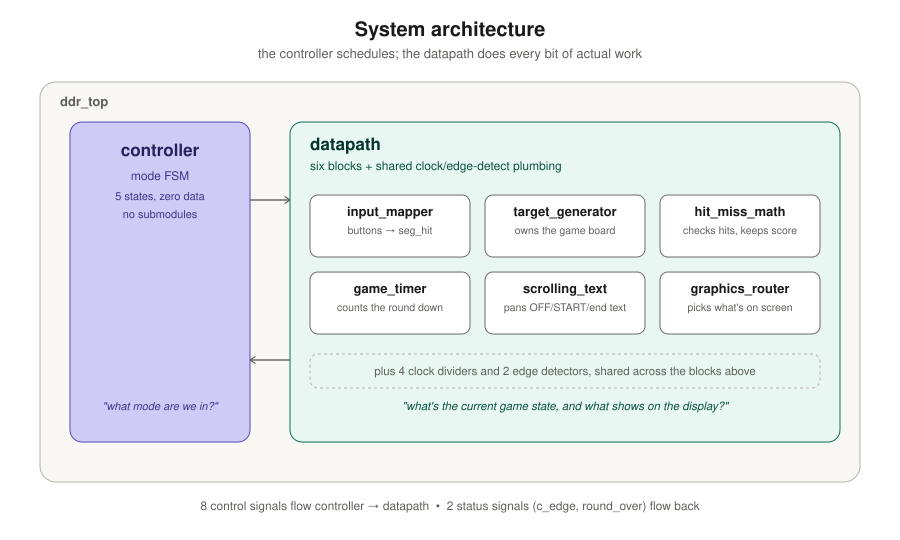

# Dance Dance Revolution — project overview

This document is the "how did we get here" story: the idea, the architecture we designed for it,
how building it actually went, and how we tested it. If you just want to *play* the game, see
`README.md` instead — this one is about the project, not the controls.

## 1. The idea

For ECE 316's Lab 4, everyone builds a "Tokyo-themed" scrolling sign on a Basys3 FPGA. There's a
baseline version (pan a few strings across a 7-segment display) and an open-ended alternative,
where you design your own project as long as it hits the same core requirements. We went
open-ended.

The pitch: what if the sign itself was the game? The Basys3's four 7-segment digits already look
like a tiny arcade cabinet — seven independently-controllable bars per digit is basically a
14-segment game board sitting there for free. So instead of just scrolling text, two of those
digits became a live playfield: segments light up on their own, and you race to clear them with
the matching button before the clock runs out. The other two digits track your score. It's a
reflex game modeled on the arcade rhythm games you'd find in Akihabara or Shibuya, just played
with your fingers on switches instead of your feet on a dance pad — hence the name.

**The core loop, in one sentence:** segments spawn, you clear them by pressing the matching
button or switch, your score goes up, and you're racing a 12-LED countdown the whole time.

## 2. What it had to do

Every Lab 4 project — baseline or open-ended — has to satisfy the same eight requirements. Ours
maps onto them like this:

| Requirement | How DDR satisfies it |
|---|---|
| Four operating modes, one an OFF state | OFF, START, GAMEPLAY, DONE (see below for why DONE became two sub-phases) |
| Mode advance via a single edge-triggered button | `BTNC`'s rising edge advances the mode every time |
| One-hot LED encoding, OFF = `0001` | `0001` / `0010` / `0100` / `1000`, exactly one LED per mode |
| Pause/resume that exactly resumes | one switch (`P`) freezes every counter and register simultaneously; nothing is lost |
| Visible, real-time animation in 3+ modes | text scrolls in START/DONE; segments spawn and the timer bar drains in GAMEPLAY |
| Static, recognizable OFF | OFF just reads "OFF", unmoving |
| Tokyo theme | arcade/rhythm-game framing throughout |
| At least one button, one switch, one slow clock | 5 buttons + 5 switches + 4 independent slow clocks |

## 3. Architecture, top to bottom

The design follows a discipline the course calls out explicitly: split the system into a
**controller** (which only tracks *what mode you're in*) and a **datapath** (which owns every
piece of actual data — the board, the score, the timer, the text). The controller never touches
game state directly; it just flips switches that tell the datapath what to do this cycle.

**The controller** is a five-state FSM (more on the fifth state in a second) that emits eight
plain on/off control signals and reads back exactly two status bits — "did the button just get
pressed" and "did the round just end." That's the entire vocabulary it needs to run the whole
game; it has no idea what a "segment" or a "score" even is.

**The datapath** is where the game actually lives, organized into six blocks, each with one job:

- **`input_mapper`** — collects the five buttons and two switches into one bundle everything else reads.
- **`target_generator`** — owns the 14-segment game board: decides where new segments randomly appear, and clears them when you hit the right one.
- **`hit_miss_math`** — checks your presses against the board and keeps the running score.
- **`game_timer`** — counts the round down and drives the 12-LED bar.
- **`scrolling_text`** — everything about the panned text screens (OFF / START / the end screen).
- **`graphics_router`** — the last stop before the physical display: decides, digit by digit, whether you're looking at the game board, the score, or scrolling text.

None of these know about "modes" — they just do their one job continuously and let the
controller's signals decide when that job matters.

## 4. The state machine

Five states, cycling forever:

The interesting design decision here was **splitting DONE into two sub-phases**. The naive version
— match the style of every other transition — would have the round end and immediately start
panning an end-screen message, the same way every other mode swaps straight to its next display.
We didn't want that. When a round ends, the game should hold on your final score first: the board
goes dark, the score sits there untouched until you actually look at it and press the button, and
*then* the end screen appears. That's a fundamentally different feel from "game just moves on
without you."

The catch: the rubric requires exactly four one-hot LED patterns. So `DONE_SCORE` and `DONE_TEXT`
both light up the same LED (`1000`) — the split is invisible on the LEDs, and the datapath tells
the two sub-phases apart internally using a signal it already had lying around, rather than
inventing a new one just for this. A full lap through the game is five button presses, not four.

## 5. How it actually got built

The path from paper design to working Verilog wasn't perfectly straight. A few things worth
knowing about how this came together:

**Consolidation over sprawl.** The first implementation pass split every register and comparator
into its own file — great for isolated unit testing, but it ballooned to nearly twice as many
files as planned and got harder to read, not easier. It got folded back down to the six blocks
above, each keeping its internal pieces clearly sectioned off so the logic still reads the same
way, just without needing to jump between files to follow one thought.

**Simulate first, always.** Every module got run through Icarus Verilog before it ever touched
Vivado. That workflow caught real bugs cheaply — including a couple of classic testbench mistakes
(changing a signal in the same instant as the clock edge that was supposed to react to it, which
races the simulator) that would've been much more annoying to debug on actual hardware.

**Real bugs only showed up once we started testing like it was real hardware.** Three worth
calling out, because none of them were visible in the paper design:

- Holding the reset switch didn't just force the mode back to OFF — it blanked the *entire*
  display, because the reset was wired into the same signal that keeps the display-scanning
  hardware running at all. Fixed by making sure the scanning logic never stops, regardless of mode.
- The static "OFF" text briefly rendered as "OOFF" — a wraparound-math edge case that only
  triggered for a string that was never actually supposed to move in the first place.
- The OFF screen would occasionally start from a leftover scroll position instead of the same
  spot every time, because one specific mode transition forgot to reset the scroll position back
  to zero.

All three are the kind of bug that a paper design simply can't catch — they only show up once
you're actually running the thing.

**The panning behavior changed after watching it run.** The original plan had text bounce back
and forth at each end, like a marquee reversing direction. In practice, that read as the display
glitching rather than intentionally scrolling. It was replaced with a continuous one-directional
loop instead — the text scrolls one way and wraps cleanly back to the start, which reads much more
like an actual arcade sign.

## 6. Testing

Two layers of testbenches, both simulation-first:

- **Unit tests** cover the controller (every state transition, every one-cycle control pulse, the
  reset behavior) and the text-scrolling engine (every letter's segment pattern, and the exact
  scroll sequence across a full loop).
- **An integration test** drives the whole chip through a full game — reset, mode advance,
  pause/resume, a forced round to completion, both DONE sub-phases, and a regression check for
  each of the three hardware bugs above, so none of them can silently come back.

Every testbench got generated with AI assistance first, then reviewed and corrected by hand —
in a few cases that review caught real mistakes in the AI's first draft (the clock-edge race
mentioned above being the main repeat offender). Nothing shipped on a testbench's word alone
without someone actually reading what it was checking.
