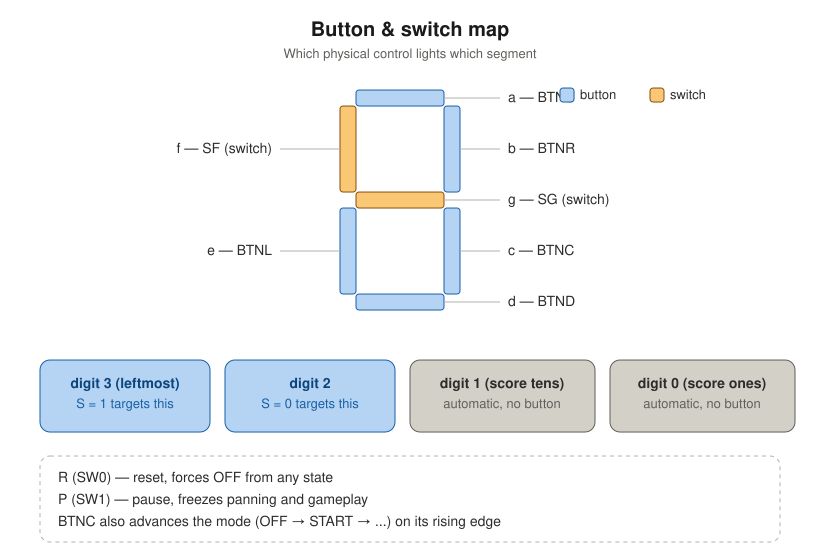
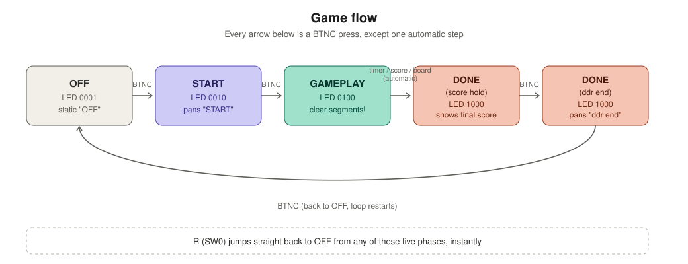
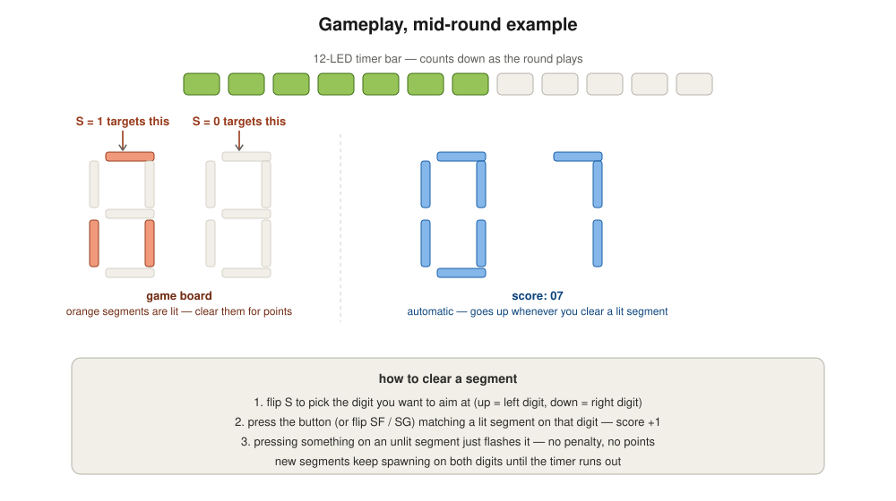

# DDR (Dance Dance Revolution) — how to play

A segment-clearing reflex game built for the Basys3, styled after the arcade rhythm games
in Akihabara and Shibuya. Two of the four seven-segment digits become a 14-segment "board";
segments light up on their own, and you race the clock to slap them out before time runs
down.

This file is a player's guide, not a build guide — it assumes the bitstream is already on
the board (see the `.v` sources and `ddr_top.xdc` in this same folder if you're setting that
part up).

## Controls at a glance

Five buttons map one-to-one onto five segments, and two switches cover the last two — no
combo presses, no ambiguity, every input owns exactly one segment:

| Control | Segment |
|---|---|
| `BTNU` | a (top) |
| `BTNR` | b (upper right) |
| `BTNC` | c (lower right) — **also the mode-advance button** |
| `BTND` | d (bottom) |
| `BTNL` | e (lower left) |
| `SF` (switch) | f (upper left) |
| `SG` (switch) | g (middle) |

Plus three more switches that don't touch segments directly:

| Switch | Function |
|---|---|
| `R` | reset — jumps straight back to OFF from anywhere, instantly |
| `P` | pause — freezes whatever's currently animating |
| `S` | digit select — flips which of the two board digits your presses target |

## The five phases

Every phase change is one `BTNC` press, except the one automatic step where the round ends
on its own. Here's what each one looks and feels like:

### 1. OFF
The display just reads **OFF**, sitting still. Nothing is animating and nothing you press
matters except `BTNC` (and `R`, which does nothing new here since you're already home).
This is where the board powers up.

**Press `BTNC` to begin.**

### 2. START
The word **START** scrolls across the display, looping — `STAR` → `TART` → `ART_` → `RT_S` →
`T_ST` → `_STA` → back to `STAR`, forever, until you press the button. Think of it as the
title-screen beat before the round begins. Flip `P` if you want to freeze the scroll and
admire it; flip it back to resume from the exact spot it stopped.

**Press `BTNC` to start the round.**

### 3. GAMEPLAY — the actual game
This is the one that matters. Walkthrough below.

### 4. DONE (score hold)
The instant the round ends, the left two digits go dark and the right two freeze on
whatever score you finished with. It just sits there — nothing about it changes until you
act.

**Press `BTNC` to see the ddr end screen.**

### 5. DONE (ddr end)
**ddr end** scrolls across all four digits, same looping style as START. This is the
"that's the game" screen.

**Press `BTNC` to loop back to OFF and go again.**

At literally any point in any of these five phases, flipping `R` snaps you straight back to
OFF — it doesn't wait for a clean transition point.

## How gameplay actually works

When GAMEPLAY starts, three things kick off at once:

- **Segments start spawning.** One at a time, at a randomish digit and position, a segment
  lights up somewhere on the two-digit board. More keep spawning as the round goes on — the
  board fills up if you don't keep clearing it.
- **The 12-LED timer bar starts counting down.** One LED turns off at a time. When it hits
  zero, the round is over, whatever your score is.
- **Your score starts at 0**, shown live on the right two digits.

To clear a segment:

1. **Flip `S`** to choose which digit you're aiming at — `S` up targets the left digit,
   `S` down targets the right digit. You can flip this mid-round as many times as you want.
2. **Press the button (or flip `SF`/`SG`)** that matches a lit segment on the targeted
   digit. If it was actually lit, it clears and your score goes up by one — clear several
   segments across both digits in the same instant and they all count.
3. **Pressing a control for an unlit segment** just flashes it for a moment — no penalty,
   no points, totally harmless. Feel free to mash.

The round ends the instant any one of three things happens: the timer bar empties, your
score hits 99, or the entire board fills up with lit segments. Whichever it is, you land on
the score-hold screen — see phase 4 above.

**Pause (`P`) works everywhere in GAMEPLAY too** — it freezes the timer, the spawning, and
the board mid-state, all at once. Flip it back and the round resumes from exactly where it
was, down to the exact segments that were lit.

## Quick reference

| Phase | LED | What's on screen | `BTNC` does |
|---|---|---|---|
| OFF | `0001` | static "OFF" | go to START |
| START | `0010` | "START" scrolling | begin the round |
| GAMEPLAY | `0100` | live board + score | nothing (only the round ending advances this) |
| DONE (score) | `1000` | blank + frozen score | show the ddr end screen |
| DONE (ddr end) | `1000` | "ddr end" scrolling | back to OFF |

Have fun — and remember `S` picks the digit before your button press does anything.
